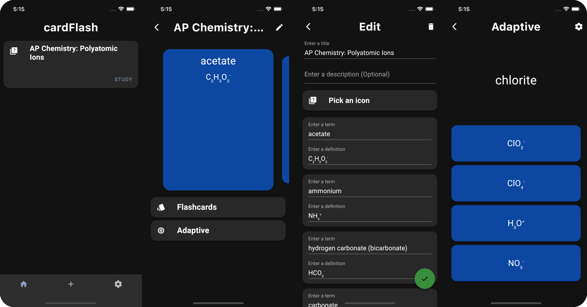

# cardFlash: Super simple flashcard studying!

    
    
    
    

<!---
## Become a [Beta Tester](amichaelyu.github.io/cardFlashBeta)
--->
## Features
- Import from Quizlet
- Sharing via QR codes
- Creation of your own sets
- Folders
- Flashcard Mode with Smart Mode
- Adaptive Mode (Similar to Quizlet Learn)

## Issues and Features

Issues or new features can be reported via the [issue tracker](https://github.com/amichaelyu/cardFlash/issues). Please make sure your issue or feature has not yet been reported by anyone else before submitting a new one.

## Privacy

cardFlash does not collect personally identifiable information in any way. Please refer to the [privacy policy](https://github.com/amichaelyu/cardFlash/blob/master/PRIVACY.md) for information.
